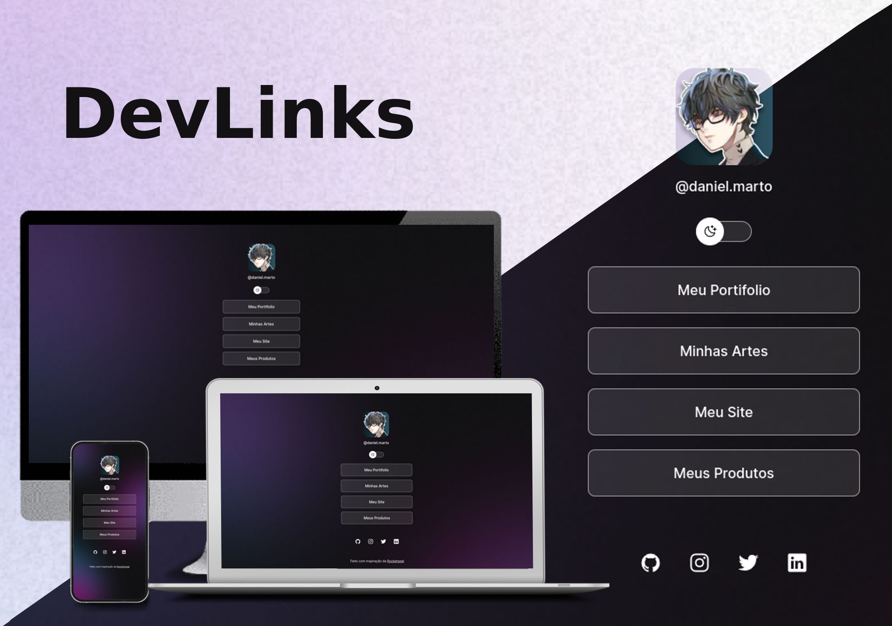

<h1 align="center">DevLinks</h1>

Um site montado como um cartão de visita, incluido links de redes sociais e sites.

    

## Tecnologias

Esse Projeto foi desenvolvido com as seguintes tecnologias:

- HTML e CSS
- JavaScript
- Git e Github
- Figma

## Projeto

O Dev links é um agregador de links para usar como um cartão de visitas online.

## Licença

Esse projeta está sob a licença MIT.